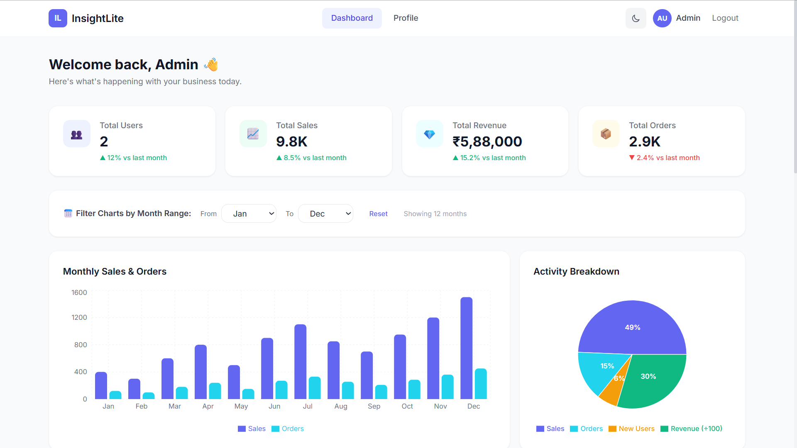
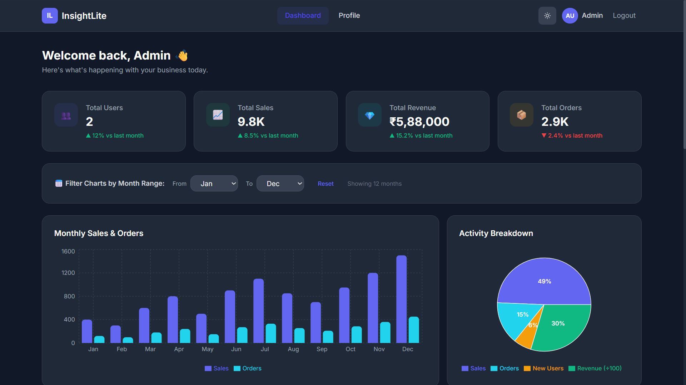
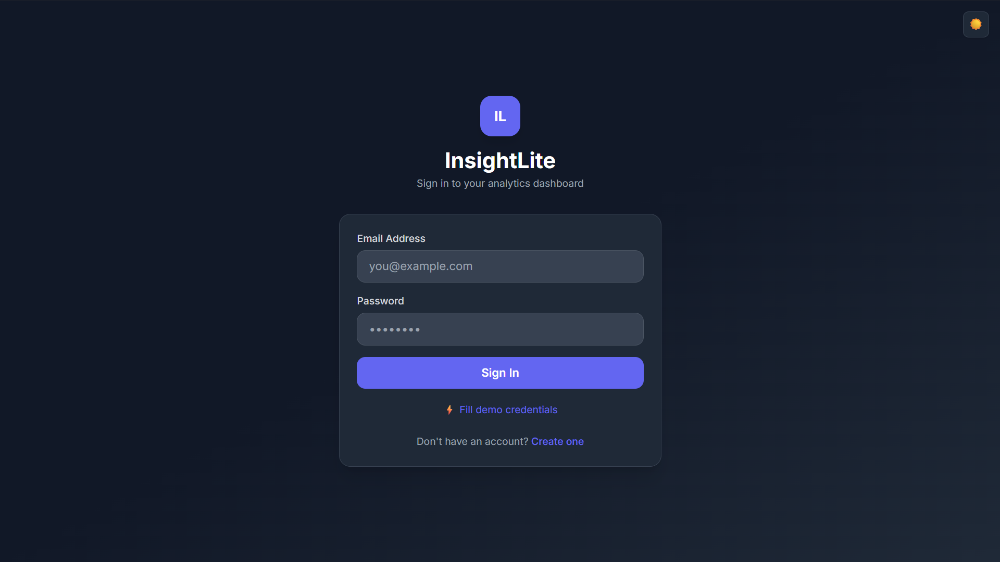
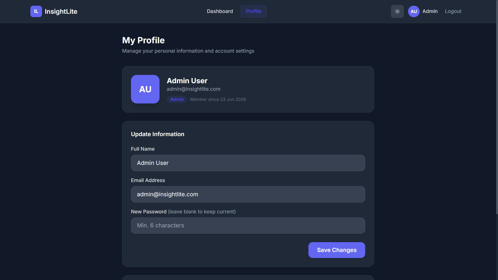

# 📊 InsightLite — MERN Stack Analytics Dashboard


> Built to learn full-stack development end-to-end — covers JWT authentication, REST APIs, data visualization, and responsive UI in one complete project.

🔗 **Live Demo:** _Coming soon (deploying on Vercel + Render)_

---

## 📸 Screenshots

| Dashboard (Light Mode) | Dashboard (Dark Mode) |
|---|---|
|  |  |

| Login Page | Profile Page |
|---|---|
|  |  |

---

## ✨ Features

| Feature | Description |
|---|---|
| 🔐 JWT Auth | Secure register & login with token-based sessions |
| 📊 Summary Cards | Total Users, Sales, Revenue, Orders |
| 📈 Bar Chart | Monthly sales & orders (Recharts) |
| 🥧 Pie Chart | Activity category breakdown |
| 📋 Activity Table | Recent events with live debounced search |
| 👤 Profile Page | View & edit user info |
| 🌙 Dark Mode | System-aware dark/light toggle |
| 📱 Responsive | Mobile + desktop layout |

---

## 🛠️ Tech Stack

**Frontend**
- React 18 + Vite
- Tailwind CSS (styling)
- Recharts (charts)
- Axios (API calls)
- React Router v6 (navigation)

**Backend**
- Node.js + Express.js
- Mongoose (MongoDB ODM)
- JSON Web Tokens (auth)
- bcryptjs (password hashing)

**Database**
- MongoDB (3 collections: `users`, `analytics`, `activities`)

---

## 🗂️ Project Structure

```
insightlite/
├── assets/                       # Screenshots for README
│   ├── dashboard-light.png
│   ├── dashboard-dark.png
│   ├── login.png
│   └── profile.png
├── backend/
│   ├── config/
│   │   └── seed.js               # Database seeder (demo data)
│   ├── controllers/
│   │   ├── authController.js     # Register, login, get user
│   │   ├── analyticsController.js # Charts & summary data
│   │   └── userController.js     # Profile update
│   ├── middleware/
│   │   └── authMiddleware.js     # JWT route protection
│   ├── models/
│   │   ├── User.js
│   │   ├── Analytics.js
│   │   └── Activity.js
│   ├── routes/
│   │   ├── authRoutes.js
│   │   ├── analyticsRoutes.js
│   │   └── userRoutes.js
│   ├── .env.example
│   ├── package.json
│   └── server.js
│
└── frontend/
    ├── src/
    │   ├── components/
    │   │   ├── ActivityTable.jsx  # Table with search
    │   │   ├── CategoryPieChart.jsx
    │   │   ├── Navbar.jsx
    │   │   ├── PrivateRoute.jsx   # Auth guard
    │   │   ├── SalesBarChart.jsx
    │   │   └── StatCard.jsx
    │   ├── context/
    │   │   ├── AuthContext.jsx    # Global auth state
    │   │   └── ThemeContext.jsx   # Dark/light mode
    │   ├── pages/
    │   │   ├── Dashboard.jsx
    │   │   ├── Login.jsx
    │   │   ├── NotFound.jsx
    │   │   ├── Profile.jsx
    │   │   └── Register.jsx
    │   ├── utils/
    │   │   ├── api.js             # Axios instance with interceptor
    │   │   └── helpers.js
    │   ├── App.jsx
    │   ├── index.css
    │   └── main.jsx
    ├── index.html
    ├── package.json
    ├── tailwind.config.js
    └── vite.config.js
```

---

## 🚀 Setup Instructions

### Prerequisites
- Node.js v18+
- MongoDB (local or [MongoDB Atlas](https://www.mongodb.com/cloud/atlas) free tier)
- npm

---

### Step 1 — Clone / Download
```bash
cd insightlite
```

---

### Step 2 — Backend Setup

```bash
cd backend
npm install
cp .env.example .env
```

Open `.env` and fill in your values:

| Variable | Description | Example |
|---|---|---|
| `PORT` | Backend server port | `5000` |
| `MONGO_URI` | MongoDB connection string | `mongodb://localhost:27017/insightlite` |
| `JWT_SECRET` | Secret key for signing tokens | `any_long_random_string` |
| `JWT_EXPIRE` | Token expiry duration | `7d` |

> 💡 For MongoDB Atlas, replace `MONGO_URI` with your Atlas connection string.

---

### Step 3 — Seed the Database

```bash
npm run seed
```

This creates:
- 12 months of analytics data
- 15 sample activity records
- 1 demo admin account

**Demo credentials:**
```
Email:    admin@insightlite.com
Password: admin123
```

---

### Step 4 — Start Backend

```bash
npm run dev
```

Backend runs at: `http://localhost:5000`

✅ Test it: `http://localhost:5000/api/health` → should return `{"status":"OK"}`

---

### Step 5 — Frontend Setup

Open a new terminal:

```bash
cd frontend
npm install
npm run dev
```

Frontend runs at: `http://localhost:5173`

---

## 🌐 API Endpoints

### Auth
| Method | Endpoint | Access | Description |
|---|---|---|---|
| POST | `/api/auth/register` | Public | Create account |
| POST | `/api/auth/login` | Public | Login & get token |
| GET | `/api/auth/me` | Private | Get current user |

### Analytics
| Method | Endpoint | Access | Description |
|---|---|---|---|
| GET | `/api/analytics/summary` | Private | Stats cards data |
| GET | `/api/analytics/chart` | Private | Bar chart data |
| GET | `/api/analytics/pie` | Private | Pie chart data |
| GET | `/api/analytics/activities?search=` | Private | Activity table with search |

### Users
| Method | Endpoint | Access | Description |
|---|---|---|---|
| GET | `/api/users` | Private | All users |
| PUT | `/api/users/profile` | Private | Update profile |

---

## 📸 Pages

1. **`/login`** — Sign in form with demo shortcut button
2. **`/register`** — Create new account
3. **`/dashboard`** — Main analytics view (protected)
4. **`/profile`** — View & update user info (protected)

---

## 💡 What I Learned

- How JWT authentication works end-to-end (token generation → storage → protected routes)
- Building reusable React components with Context API (no Redux needed)
- Connecting a React frontend to an Express backend with Axios interceptors
- Designing REST APIs with proper route protection using middleware
- Implementing debounced search to reduce unnecessary API calls
- Making a responsive UI with Tailwind CSS dark mode support

---

## 👨‍💻 For Your Portfolio / Interviewers

Key things to highlight:
- **JWT authentication flow** — token stored in localStorage, sent via Axios interceptor on every request
- **Protected routes** — `PrivateRoute` component wraps dashboard pages, redirects if not logged in
- **Context API** — Global auth + theme state without Redux
- **Debounced search** — Activity search waits 400ms before making API call (performance optimization)
- **Responsive design** — Works on mobile and desktop with Tailwind CSS

---

## 🐛 Common Issues

**MongoDB connection error?**
- Make sure MongoDB service is running: `sudo systemctl start mongod` (Linux)
- On Windows: check MongoDB in Services panel

**CORS error?**
- Make sure backend is running on port `5000` and frontend on `5173`

**"Cannot find module"?**
- Run `npm install` inside both `/backend` and `/frontend` folders separately

---

## 📄 License

This project is open source under the [MIT License](LICENSE).

---

Made with ❤️ for learning MERN Stack
